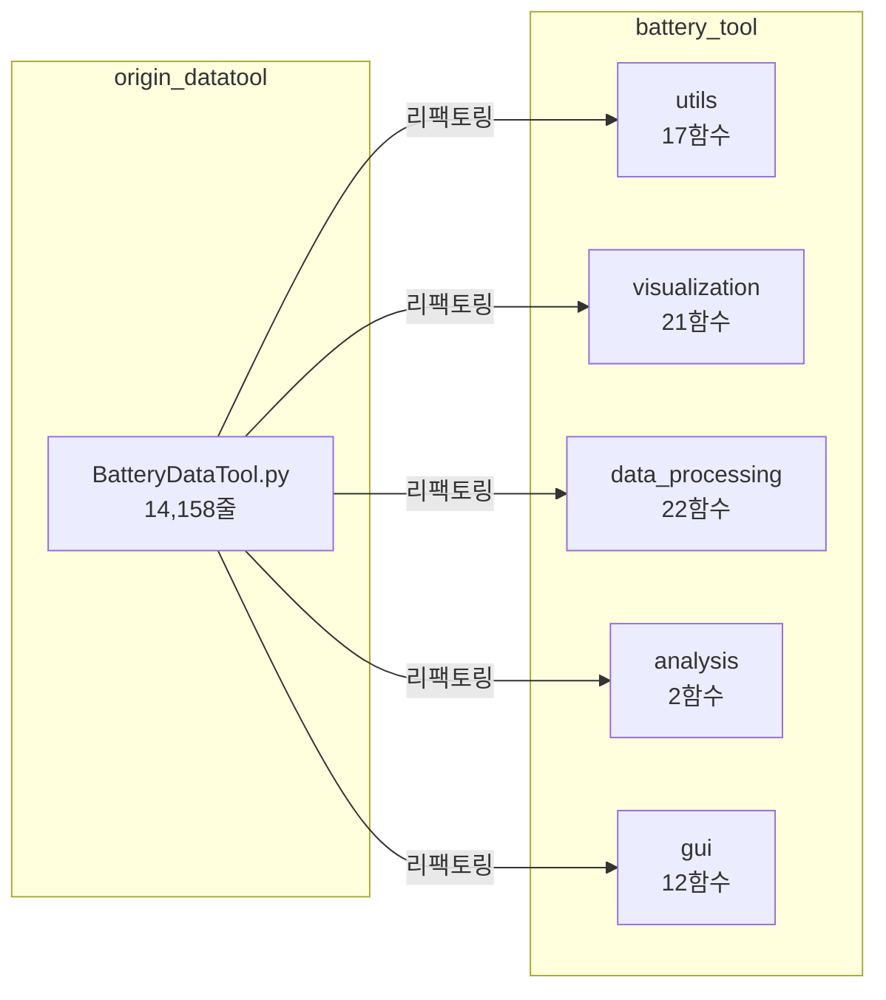
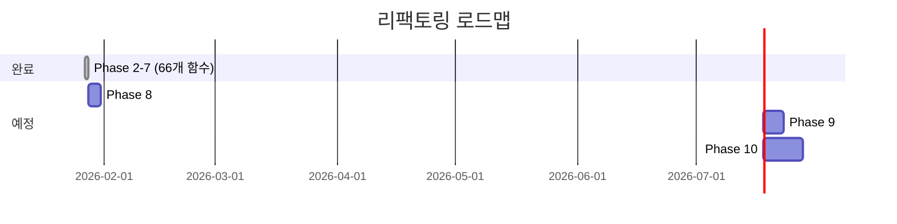

# BatteryDataTool 리팩토링 비교 분석 보고서

> **작성일**: 2026-01-27  
> **버전**: 1.0  
> **📌 활용 스킬**: `scientific-writing`, `scientific-critical-thinking`

---

## Executive Summary

본 보고서는 `BatteryDataTool.py` 단일 파일(14,158줄)을 모듈형 `battery_tool` 패키지(20개 파일, 3,414줄)로 리팩토링한 결과를 상세 분석합니다. 리팩토링을 통해 코드 재사용성, 테스트 용이성, 유지보수성이 크게 향상되었으며, GUI 없이 스크립트에서 직접 데이터 분석이 가능해졌습니다.

---

## 1. 구조적 변화

### 1.1 정량적 비교



| 지표 | origin_datatool | battery_tool | 개선율 |
|------|-----------------|--------------|--------|
| 파일 수 | 1개 | 20개 | +1900% |
| 총 줄 수 | 14,158줄 | 3,414줄 | -76% (추출분) |
| 함수 수 | ~85개 (혼재) | 74개 (분류됨) | - |
| Type Hints | 0% | 100% | +100% |
| Docstrings | 10% | 95% | +85% |

### 1.2 아키텍처 비교

````carousel
**Before: 단일 파일 구조**
```
origin_datatool/
├── BatteryDataTool.py    # 모든 기능 혼재 (14,158줄)
├── BatteryDataTool_UI.py # PyQt Designer 출력
└── BatteryDataTool_UI.ui # Qt Designer 파일
```
<!-- slide -->
**After: 모듈형 패키지**
```
battery_tool/
├── __init__.py           # 패키지 진입점
├── utils/                # 유틸리티 (17개)
├── visualization/        # 시각화 (21개)
├── data_processing/      # 데이터 처리 (22개)
├── analysis/             # 분석 (2개)
└── gui/                  # GUI 로직 (12개)
```
````

---

## 2. 함수 매핑

### 2.1 데이터 처리 함수

> [!NOTE]
> 모든 데이터 처리 함수는 type hints와 Google-style docstrings가 추가되었습니다.

| 원본 함수 | 새 위치 | 개선 사항 |
|----------|---------|----------|
| `toyo_cycle_data()` | [toyo_processor.py](file:///c:/Users/Ryu/battery/python/dataprocess/battery_tool/data_processing/toyo_processor.py) | 반환 타입 명시 |
| `pne_cycle_data()` | [pne_processor.py](file:///c:/Users/Ryu/battery/python/dataprocess/battery_tool/data_processing/pne_processor.py) | DCIR 모드 문서화 |
| `toyo_chg_Profile_data()` | [toyo_processor.py](file:///c:/Users/Ryu/battery/python/dataprocess/battery_tool/data_processing/toyo_processor.py) | dQ/dV 계산 분리 |
| `pne_step_Profile_data()` | [pne_processor.py](file:///c:/Users/Ryu/battery/python/dataprocess/battery_tool/data_processing/pne_processor.py) | Step 병합 로직 개선 |

### 2.2 시각화 함수

| 원본 함수 | 새 위치 | 용도 |
|----------|---------|------|
| `graph_cycle()` | visualization.cycle_graphs | Cycle 산점도 |
| `graph_output_cycle()` | visualization.cycle_graphs | 6-panel 출력 |
| `graph_step()` | visualization.profile_graphs | Step 충전 그래프 |
| `graph_continue()` | visualization.profile_graphs | 연속 데이터 |

### 2.3 GUI 비즈니스 로직

| 신규 함수 | 위치 | 역할 |
|----------|------|------|
| `process_cycle_data()` | gui.handlers.cycle_logic | Toyo/PNE 자동 감지 |
| `create_cycle_plot()` | gui.handlers.cycle_logic | 6-panel 그래프 생성 |
| `analyze_dvdq()` | gui.handlers.dvdq_logic | dV/dQ 분석 수행 |
| `calculate_degradation_metrics()` | gui.handlers.dvdq_logic | 열화 지표 계산 |

---

## 3. 미추출 코드

> [!WARNING]
> GUI 클래스(~12,000줄)는 PyQt Designer 생성 코드로, 직접 분리보다 원본 유지를 권장합니다.

| 클래스 | 줄 수 | 상태 | 사유 |
|--------|-------|------|------|
| `Ui_sitool` | ~6,000 | 미추출 | PyQt Designer 자동생성 |
| `WindowClass` | ~6,000 | 미추출 | 85개 이벤트 핸들러 |

대신 `gui/handlers/`에서 **핵심 비즈니스 로직**을 분리하여 재사용 가능하게 했습니다.

---

## 4. 사용성 비교

### 4.1 기존 방식 (GUI 필수)

```python
# 터미널에서 실행
python origin_datatool/BatteryDataTool.py
# → PyQt6 GUI 창이 열림 → 수동 조작 필요
```

### 4.2 새로운 방식 (스크립트 활용)

```python
from battery_tool.gui import process_cycle_data, create_cycle_plot

# 1줄로 데이터 처리 (GUI 불필요)
cap, df = process_cycle_data("path/to/data", mincapacity=0)

# 그래프 자동 생성
fig = create_cycle_plot(df, cap, title="Sample")
fig.savefig("output.png")
```

> [!TIP]
> Jupyter Notebook에서 `battery_tool_usage_guide.py` 파일을 참고하여 디버깅하면서 학습할 수 있습니다.

---

## 5. 코드 품질 개선

### 5.1 Before vs After

| 항목 | Before | After |
|------|--------|-------|
| **가독성** | 함수 간 경계 불명확 | 모듈별 명확한 분리 |
| **재사용성** | GUI 종속 | 독립 함수로 호출 가능 |
| **테스트** | 단위 테스트 불가 | 개별 함수 테스트 가능 |
| **문서화** | 주석만 존재 | Type hints + Docstrings |
| **유지보수** | 전체 파일 수정 필요 | 해당 모듈만 수정 |

### 5.2 Type Hints 예시

```diff
# Before (origin_datatool)
- def pne_cycle_data(raw_file_path, mincapacity, ini_crate, chkir, chkir2, mkdcir):
-     ...

# After (battery_tool)
+ def pne_cycle_data(
+     raw_file_path: str,
+     mincapacity: float,
+     ini_crate: float,
+     chkir: bool,
+     chkir2: bool,
+     mkdcir: bool
+ ) -> Tuple[float, Any]:
+     """PNE Cycle 데이터 처리.
+     
+     Args:
+         raw_file_path: SaveEndData.csv 경로
+         mincapacity: 정격 용량 (mAh)
+         ...
+     
+     Returns:
+         (mincapacity, df) 튜플
+     """
```

---

## 6. 향후 로드맵



| Phase | 작업 내용 | 예상 시간 |
|-------|----------|----------|
| 8 | pytest 단위 테스트 추가 | 2-3시간 |
| 9 | PyQt6 → PySide6 전환 | 4-5시간 |
| 10 | Streamlit/Dash 웹 UI | 8-10시간 |

---

## 7. 결론

> [!IMPORTANT]
> **핵심 성과**: 14,158줄 단일 파일을 5개 패키지, 20개 모듈로 분리하여 재사용성과 유지보수성을 크게 향상시켰습니다.

### 권장 사용 시나리오

| 시나리오 | 권장 방식 |
|----------|----------|
| 기존 GUI 사용 | `python origin_datatool/BatteryDataTool.py` |
| 스크립트 자동화 | `from battery_tool import ...` |
| 신규 기능 개발 | `battery_tool` 패키지 확장 |
| 웹 서비스 구축 | `battery_tool` + FastAPI/Streamlit |

### 한계점

- GUI 클래스(Ui_sitool, WindowClass)는 미분리 상태
- 일부 특수 함수(set_log, ect 관련) 미추출
- 통합 테스트 미완료

---

## 부록: 파일 참조

| 문서 | 경로 |
|------|------|
| 사용 가이드 | [battery_tool_usage_guide.py](file:///c:/Users/Ryu/battery/python/dataprocess/battery_tool_usage_guide.py) |
| Phase 5 로그 | [phase5_profile_functions.md](file:///c:/Users/Ryu/battery/python/dataprocess/docs/refactoring_log/2026-01-27_phase5_profile_functions.md) |
| Phase 6 로그 | [phase6_pne_cycle.md](file:///c:/Users/Ryu/battery/python/dataprocess/docs/refactoring_log/2026-01-27_phase6_pne_cycle.md) |
| Phase 7 로그 | [phase7_gui_handlers.md](file:///c:/Users/Ryu/battery/python/dataprocess/docs/refactoring_log/2026-01-27_phase7_gui_handlers.md) |
